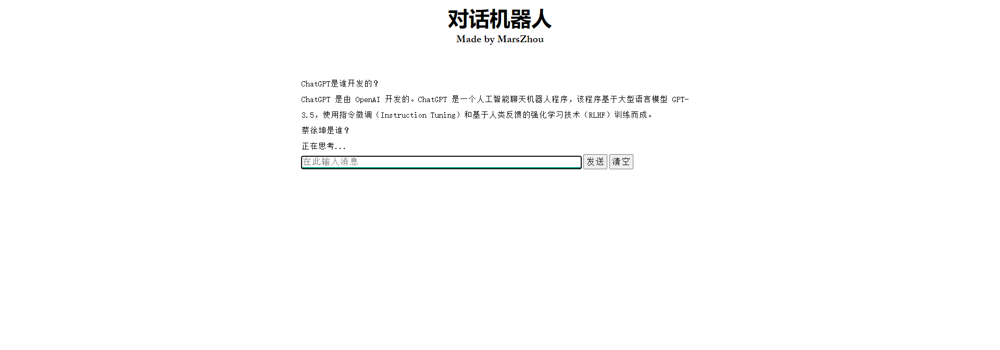

# llm-chatbot
## 介绍

**llm-chatbot 是基于开源大语言模型🤗和微软TTS的聊天机器人**

后端使用用Flask搭建，前端使用jQuery

-----

## 更新信息
**[2023/10/04]** 支持基于ChatGLM2-6B进行对话。

## 界面效果

## 部署

服务器需要一张A10或V100显卡即可

运行 flask --app run.py run --port 8000

## 友情链接
* [llm](https://github.com/THUDM/ChatGLM2-6B): 使用的大语言模型
* [ms-tts](https://github.com/skygongque/tts): 微软TTS
